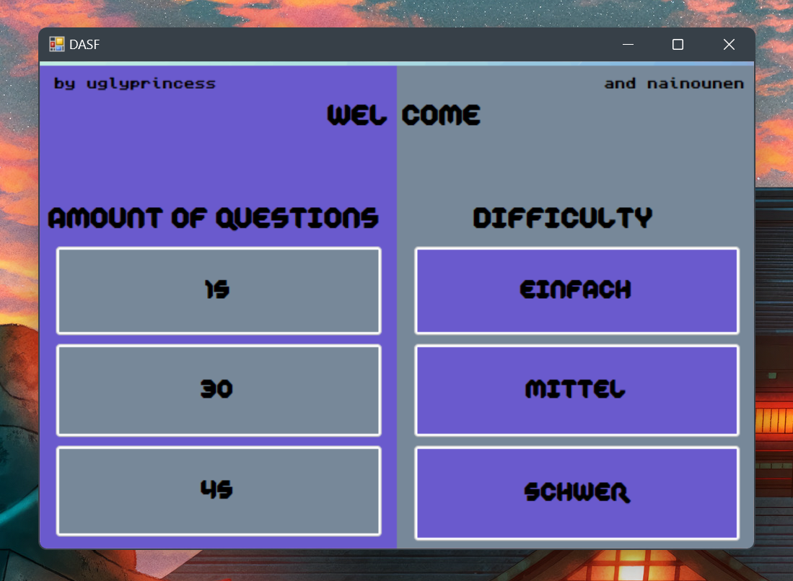
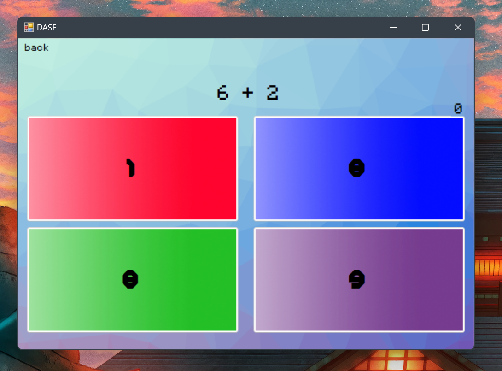
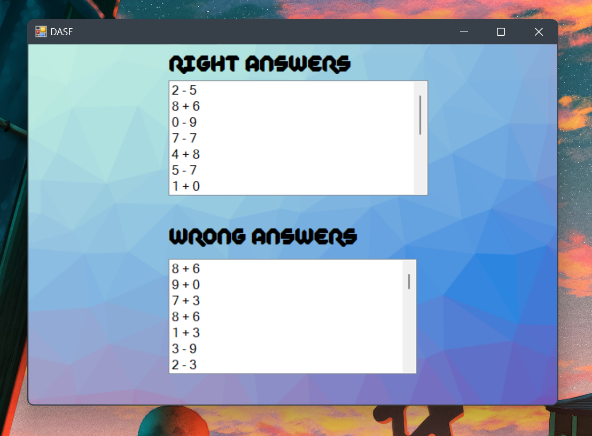

## Math Quiz

Math Quiz is an engaging educational application designed to help kids develop their mathematical skills through interactive quizzes, exercises, and fun 
challenges. With Math Quiz, children can enjoy learning math in a playful environment that promotes cognitive development.

**Table of Contents**

* [Key Features](#key-features)
* [Installation](#installation)
* [Usage](#usage)
* [Contributing](#contributing)
* [Screenshots](#screenshots)

## Key Features

1. **Engaging Quizzes:** Participate in a variety of interactive quizzes that cover addition, subtraction, multiplication, and division concepts, making 
learning math enjoyable for kids.
2. **User-Friendly Interface:** Math Quiz features a colorful and intuitive interface designed specifically for children, ensuring easy navigation through 
different quiz categories.
3. **Progress Tracking:** Monitor your child's progress and improvement over time with comprehensive performance summaries after each quiz session, 
encouraging continuous learning and growth.

## Installation

### Using Visual Studio (Highly Recommended)

1. Install the latest version of [Visual Studio](https://visualstudio.microsoft.com/downloads).
2. Clone the repository: `https://github.com/Uglypr1nces/Math_Quiz.git`
3. Run the project.
4. You will encounter a file missing error, but don't worry! After running the project, execute the `file_mover.ps1` script using PowerShell to resolve the 
issue.

### Using Command Line

1. Clone the repository: `git clone https://github.com/Uglypr1nces/Math_Quiz.git`
2. Install dotnet:
```bash
   curl -SL -o dotnet-install.ps1 https://dot.net/v1/dotnet-install.ps1
   powershell -ExecutionPolicy Bypass -File dotnet-install.ps1
   dotnet --version
```
3. Build and run the program on your Windows system:
```bash
   cd Math_Quiz
   dotnet build MATH.sln
```
4. Move necessary files using the `file_mover.ps1` script: `powershell -file file_mover.ps1`
5. Enjoy! Run the application from the `bin/Debug` directory: `cd MATH/bin/Debug && MATH.exe`

## Contributing

We welcome contributions from the community to help improve Math Quiz further. Whether it's adding new quiz categories, enhancing the user interface, or 
optimizing performance, your contributions are highly appreciated. Please refer to our contribution guidelines for more information on how to get involved.

## Screenshots




